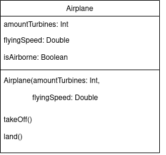
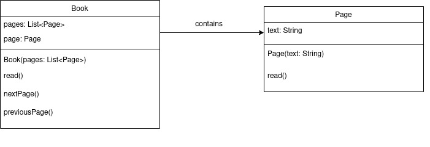
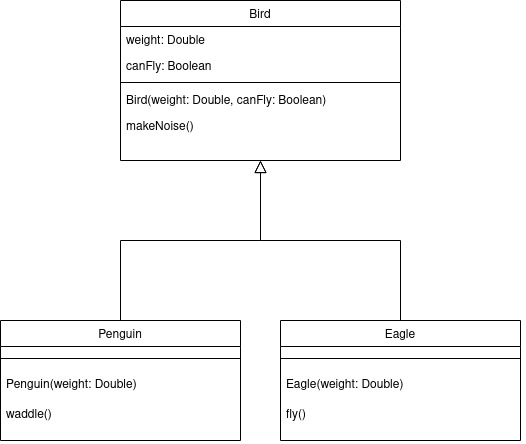

<h1 align="center">Grundlagen der Programmierung</h1>
<h3 align="center">Objektorientierte Programmierung</h3>

<p align="center">
  
</p>

#### Beschreibung:

- Willkommen zurück! Heute geht es noch weiter um objektorientierte Programmierung.

#### Hinweise zur Bearbeitung:

- Achte auf einen sauberen Quellcode, insbesondere Einrückungen sind wichtig!
- Wichtige Materialien für heute:
  - [Handbuch: Objektorientierte Programmierung (OOP)  → Implementieren ](https://docs.google.com/document/d/13SyoQ3tgIr4T9tiUl42V5kiBGQwV4Lk-XA2SsKf-va0/edit#heading=h.a4e6zghf5f6g)


---

<details>
<summary><b>Aufgabe 1 - Code beschreiben I </b></summary>

Schau dir den folgenden Codeausschnitt an.  
- Beschreibe in einem Text, was dieser Codeausschnitt macht.

```kotlin
class Car {
  var color: String
  var speed: Int

  constructor(color: String, speed: Int) {
    this.color = color
    this.speed = speed
  }

  fun paint(color: String) {
    this.color = color
  }

  fun tune() {
    speed = speed + 10
  }
}
```
- Beschreibe in einem Text, was dieser Codeausschnitt macht.
```kotlin
var car: Car = Car("weiss", 150)

car.paint("schwarz")
car.tune()

println(car.color)
println(car.speed)
```

**Modul für die Aufgabe:** Aufgabe1  
**Datei für die Aufgabe:** TextAufgabe.kt

</details>

---

<details>
<summary><b> Aufgabe 2 - Code beschreiben II </b></summary>

Schau dir den folgenden Codeausschnitt an.
- Beschreibe in einem Text, was dieser Codeausschnitt macht.

```kotlin
class Car {
  var color: String
  var speed: Int

  constructor(color: String, speed: Int) {
    this.color = color
    this.speed = speed
  }

  fun showOff() {
    println(
      "Mein Auto ist das coolste! Es ist " + color +
              " und " + speed + " kmh schnell!"
    )
  }

  fun drive() {
    if (speed > 180) {
      println("Du wurdest geblitzt!")
    } else {
      println("Du wurdest nicht geblitzt.")
    }
  }
}
```

- Beschreibe in einem Text, was dieser Codeausschnitt macht.

```kotlin
val car = Car("Audi", 180)
car.showOff()
car.drive()
```

**Modul für die Aufgabe:** Aufgabe2  
**Datei für die Aufgabe:** TextAufgabe.kt

</details>

---

<details>
<summary><b>Aufgabe 3 - Code beschreiben III </b></summary>

Schau dir den folgenden Codeausschnitt an.
- Beschreibe in einem Text, was dieser Codeausschnitt macht.

```kotlin
class Person {
  var age: Int

  constructor(age: Int) {
    this.age = age
  }

  fun birthday(){
    age = age + 1
  }

  fun isUnderage() : Boolean {
    return(age < 18)
  }
}
```

- Beschreibe in einem Text, was dieser Codeausschnitt macht.

```kotlin
var person = Person(15)
person.birthday()
println(person.isUnderage())
```

**Modul für die Aufgabe:** Aufgabe3  
**Datei für die Aufgabe:** TextAufgabe.kt

</details>

---

<details>
<summary><b>Aufgabe 4 - Klassendiagramm I - Flugzeug </b></summary>

Ihr habt heute in der Vorlesung vereinfachte Klassendiagramme kennengelernt.  
Hier ist ein Klassendiagramm eines Flugzeugs.  

Es verfügt über die Eigenschaften:
- amountTurbines, dass die Anzahl der Turbinen angibt.
- flyingSpeed, dass die Fluggeschwindigkeit in Km/h angibt.
- isAirborne, das angibt, ob das Flugzeug gerade fliegt.

Es verfügt ebenso über einen Konstruktor und zwei Methoden.
- Die Methode takeOff() prüft, ob das Flugzeug bereits fliegt, wenn nicht, setzt es die Eigenschaft isAirborne auf true.
- Die Methode land() prüft, ob das Flugzeug gerade am fliegen ist, wenn ja, setzt es die Eigenschaft isAirborne auf false.

Das Flugzeug befindet sich zu Begin auf dem Boden.

<p align="center">
  
</p>

Aufgabe:

- Erstelle die Klasse.
- Instanziiere ein Flugzeug-Objekt, lass es fliegen und landen. 
- Stelle sicher, das ein Flugzeug nicht abheben kann, wenn es bereits in der Luft ist.

**Modul für die Aufgabe:** Aufgabe4  
**Datei für die Aufgabe:** Airplane.kt
</details>

---

<details>
<summary><b>Aufgabe 5 - Klassendiagramm II - Ein Buch mit Seiten </b></summary>

Hier ist ein Klassendiagramm von einem Buch und einer Seite.

Eine Seite hat einen Text und eine Methode read(), die den Text in der
Konsole ausgibt.

Ein Buch hat eine Liste mit mehreren Seiten. 
Das Buch hat ebenso eine Seite page, die gerade aufgeschlagen ist.
Der Leser kann zwischen den Seiten wechseln (nextPage() und previousPage()).
Und der Leser kann die gerade aufgeschlagene Seite lesen read().
Zu Begin ist die erste Seite aufgeschlagen.

<p align="center">
  
</p>

Aufgabe:

- Erstelle die Klassen.
- Instanziiere eine Buch-Instanz mit mehreren Seiten-Instanzen. 
- Wechsel dann ein paar mal zwischen den Seiten. 
Achte darauf, dass du nicht weiter blättern kannst, wenn du bereits an der letzten Seite angekommen bist.
- Lies einmal das Buch von vorne nach hinten und einmal von hinten nach vorne.
- Du kannst den folgenden Text für die Seiten verwenden oder dir selbst einen Text 
ausdenken.

    
    Seite 1:  Das ist der Anfang des Buches.
    Seite 2:  Jetzt sind wir auf Seite 2.
    Seite 3:  Hier haben wir gerade Seite 3. erreicht.
    Seite 4:  Nun sind wir bei der letzten Seite angekommen.

Bonus:

- Erweitere die Buch- oder Seiten-Klasse um weitere Methoden und Eigenschaften.

**Modul für die Aufgabe:** Aufgabe5  
**1. Datei für die Aufgabe:** Book.kt  
**2. Datei für die Aufgabe:** Page.kt
</details>


---

<details>
<summary><b>Aufgabe 6 - Intro - Vererbung </b></summary>

Du hast heute in der Vorlesung ein Prinzip der objektorientierten Programmierung kennengelernt, nämlich Vererbung.  
Vererbung ermöglicht es eine bereits geschriebene Klasse (Haustier) zu erweitern (Meerschweinchen).
Die erbende Klasse (Meerschweinchen) besitzt dann alle Eigenschaften und alle Methoden der 
Elternklasse (Haustier). Dadurch müssen wir geschriebenen Code nicht für jede Klasse erneut schreiben,
sondern können den Code einfach vererben. 

Gegeben ist eine Klasse "Haustier". Sie enthält Namen und Alter und eine Methode, um sie zu streicheln.  
Achte auf das `open` in der ersten Zeile.

```kotlin
open class Haustier(name: String, age: Int) {
  var name: String = name
  var age: Int = age

  fun pet(){
    println("Dein Haustier hat sich streicheln lassen.")
  }
}
```

Zusätzlich haben wir noch eine Klasse "Meerschweinchen", die von der Klasse Haustier erbt.  
Achte auf das ` : Haustier(name, age)` in der ersten Zeile.

```kotlin
class Meerschweinchen(name: String, age: Int, val jumpheight: Int) : Haustier(name, age) {

  fun jump(heightSleepPlace: Int): Boolean {
    return heightSleepPlace <= jumpheight
  }
}
```

In unserer main()-Funktion steht folgendes:

```kotlin
var kruemel: Meerschweinchen = Meerschweinchen("Kruemel", 3, 25)
kruemel.pet()
println("Dein Haustier heisst " + kruemel.name + " und ist " + kruemel.age + " Jahre alt.")
println(kruemel.jump(30))
```

- Was gibt das Programm aus?
- Wir instanziieren eine Meerschweinchen-Instanz. In der Meerschweinchen-Klasse 
ist keine Methode pet(), dennoch können wir die Meerschweinchen-Instanz mit pet() streicheln.
Warum?
- Die Meerschweinchen-Klasse hat keine Eigenschaften name und age, dennoch 
können wir über die Meerschweinchen-Instanz auf die Eigenschaften zugreifen. Warum?
- Was macht das Keyword? `open` 
- Was macht der Codeausschnitt hier? ` : Haustier(name, age)`

**Modul für die Aufgabe:** Aufgabe6  
**Datei für die Aufgabe:** Vererbung.kt

</details>

---

<details>
<summary><b>Aufgabe 7 - Pinguine und Adler </b></summary>

Wir wollen ein paar Vögel für ein Spiel abbilden.
Hier siehst du das Klassendiagramm für die drei Klassen:
- Basisklasse Vogel (Bird)
- Unterklasse Pinguin (Penguin)
- Unterklasse Adler (Eagle)

Ein Vogel hat die Eigenschaften:
- Gewicht (weight), dass das Gewicht des Vogels in Gramm angibt.
- ein Boolean (canFly), ob der Vogel fliegen kann (true) oder nicht (false).

Außerdem hat der Vogel einen Konstruktor und die Methode makeNoise(), 
dass in der Konsole "Animal noises." ausgibt.

Die Pinguin-Klasse erbt von der Vogel-Klasse.
Für den Parameter canFly übergibt die Pinguin-Klasse ein false (Auch wenn 
Pinguine Vögel sind, können sie nicht fliegen).
Zusätzlich können Pinguine watscheln (waddle()), das "Waddle waddle..." in der Konsole ausgibt.
Die Pinguin-Klasse hat einen Konstruktor mit einem Parameter weight.

Die Adler-Klasse erbt von der Vogel-Klasse. Für den Parameter canFly übergibt die Adler-Klasse ein true.
Daher hat die Adler-Klasse die Methode fly(), das "Fly free like an eagle!" in der Konsole ausgibt.
Die Adler-Klasse hat einen Konstruktor mit einem Parameter weight.

(Der weiße Pfeil im Klassendiagramm zeigt an, dass von der Klasse Bird geerbt wird)

<p align="center">
  
</p>

Aufgabe:

- Erstelle die Klassen, erstelle dazu selbstständig die Dateien, die du brauchst.
- Instanziiere dann in einer main()-Funktion einen Adler und einen Pinguin, jeweils mit einem
beliebigen Gewicht.
- Gib für beide Vögel in der Konsole aus, ob sie fliegen können.
- Lass beide Vögel Geräusche machen.
- Lass den Pinguin watscheln und den Adler fliegen.

Bonus:

- Füge einen weiteren Vogel als Unterklasse hinzu.

**Modul für die Aufgabe:** Aufgabe7
</details>

---